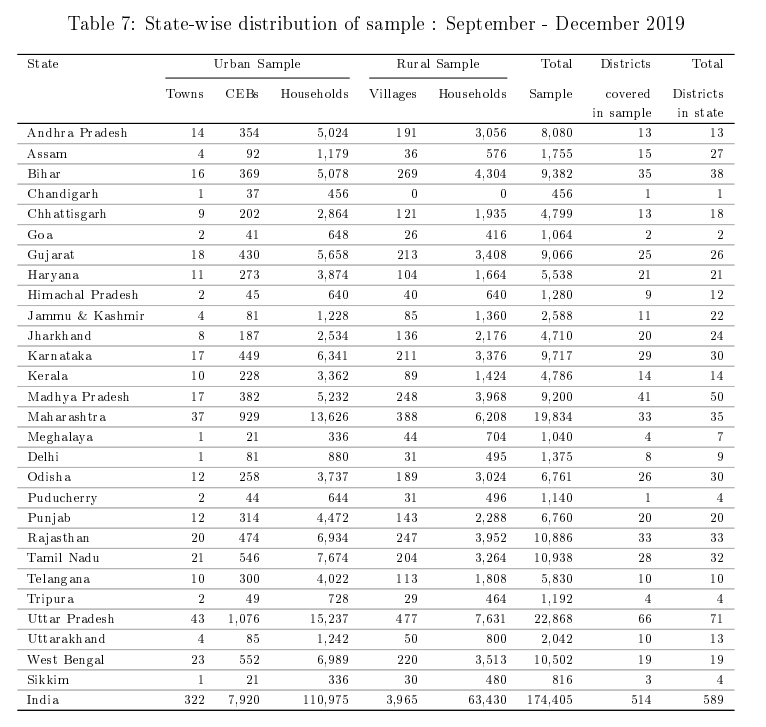

# Survey Design (Vyas, 2020c)

## Stratification

- Multi-stage stratified survey design

- **Broadest Level of Stratification:** Homogenous Regions (HRs)

- **Second Level of Stratificaton:** Urban/Rural. Urban is divided into 4 further categories.

- **Primary Sampling Units (PSUs):** Villages & Towns of 2011 Census

- **Ultimate Sampling Units (USUs):** Households

## Homogenous Regions (HRs)

- Broadest level of stratification.

- Neighbouring districts within a state with relatively similar agro-climatic conditions, urbanisation, female literacy and household size as per the 2011 Census.

- 640 Districts $\rightarrow$ 110 HRs

- For full list, check Table 1 (Page 5) of Vyas (2020c).

## Urban/Rural Sub-Starta

- Second level of stratification.

- Each HR is further divided into 5 possible sub-strata:

  - Rural

  - Very Large (VL) Towns \[\>200k households\]

  - Large (L) Towns \[60k - 200k households\]

  - Medium (M) Towns \[20k - 60k households\]

  - Small (S) Towns \[\<20k households\]

- The above classification of towns was needed to account for high variation in size.

## Urban/Rural Sub-Strata (contd.)

- Total of 412 sub-strata at this level.

. . .

::: callout-note
Not every HR has all 5 kinds of sub-strata
:::

## Primary Sampling Units (PSUs)

- PSUs are at the level of a village/town.

- Initially, 25-30 villages from each rural sub-stratum were randomly selected. This was increased in certain HRs in 2015 to increase the coverage of districts and sub-districts.

- 2,975 villages (Jan-Apr 2014 Wave) $\rightarrow$ 3,965 Villages (Sep-Dec 2019 Wave)

- At least 1 town from each available town-size sub-stratum was selected. (Some towns from a previous 2013 survey sample were retained, leading to \>1 town.)

- 318 Towns (Jan-Apr 2014 Wave) $\rightarrow$ 322 Towns (May-Aug 2019 Wave)

## Ultimate Sampling Units (USUs)

- USUs are at the level of household.

- Simple random sampling could not be implemented due to lack of a household roster

- Every $n^{th}$ household from a street is selected, where $n$ is an integer between 5 and 15

- 16 households were selected each village PSU. Sample size is occasionally larger due to logistical reasons.

- From each town PSU, 21 Census Enumeration Blocks (CEB) are selected. A CEB is a cluster of 100-125 neighbourhoods. 16 households are selected per CEB.

## USUs (contd.)

> The team was instructed to enter the main street from the east if such an entrance existed, else from the northern end, else west and the last option being south. The selections were linear down the street with every alternate selection of a household being made from opposite sides of the street if such a process of crossing the street was possible in the topography. If the required sample was not exhausted before the end of the street, the inner streets were accessed.

> *(In Towns)* At times the selection was vertical in CEBs.

## Sample Distribution

{fig-align="center"}

# Changes in Sample (Vyas, 2020a)

## Changes in Sample

- CPHS' design allows for convenient changing of sample, if required.

- Unlike NSSO, the size of CPHS sample is not distributed according to the populations of state/region. Instead, a minimum sample size is set at every stratum.

- Weights are used to ensure representativeness.

## Methods for Changing Sample

1.  **Dropping of Households (USUs)**: If houses are locked/unoccupied/demolished, their status is noted and they are counted in the current wave. They are dropped in the subsequent wave.

2.  **Replacement**: Replacement occurs at the PSU/CEB level due to logistical challenges. It is done using simple random sampling from the HR (without replacement of the dropped unit).

. . .

::: {style="margin-left: 1em"}
Replacement of USUs is not allowed to avoid convenience bias; they can only be dropped. If a large number of USUs are dropped in a PSU, the PSU is replaced.
:::

## Methods for Changing Sample (Contd.)

3.  **Restoration of Sample Size**: The ideal sample size of household in CPHS was set at 336 in a town HR and 450 in an rural HR. The sample size was changes in some large and small towns. Over time as the sample was corrected for challenges during execution, the sample size from many HRs drifted away from the original design.

. . .

::: {style="margin-left: 1em"}
A restoration exercise was taken up in 2015 to bring sample size close to the desired size. CEBs were added/dropped from town using simple random sampling.
:::

## Methods for Changing Sample (Contd.)

4.  **Re-Calibration of Sample**: When the 2011 census data was released in 2015, CPHS town-level sample composition was re-calibrated to match the distribution of the data on materials used in walls, roof and floor of houses. This was done by adding/dropping CEBs

## Methods for Changing Sample (Contd.)

5.  **Expansion**: The CPHS sample has gradually expanded over time. It also expanded sharply in 2017 due to greater budgetary allocation. New PSUs/CEBs are added using simple random sampling from the HR.

. . .

::: {style="margin-left: 1em"}
The only exception to this process is when expansion is intentionally done expand coverage of districts. Although this could cause bias, it is necessary to ensure representativeness.
:::

## Timings of Surveys (Vyas, 2020b)

- Each year is divided in 4 waves. A household is interviewed once in each wave.

- Each wave is divided in 4 monthly slots, which are further divided in 4 weekly slots.

- It is attempted that a household is interviewed in the same weekly slot in every wave.

- Weekly spillovers are allowed. Monthly spillovers are allowed but minimized. Spillovers over waves are not allowed.

# Weighting (Vyas, 2020d)

## Weighting

- Weighting is done to ensure a survey is representative of the population.

- From of population of $N$ households, if $n$ are selected using simple random sampling, each household represents $\frac{N}{n}$ households in the population.

- There are two key challenges here: i) Estimating $N$ at the level of a strata and ii) dealing with regions that could not be surveyed

## Official Population Projection

- When CPHS was being designed in 2013, a Technical Group constituted by the Office of the Registrar General and Census Commissioner was tasked with generating population projections.

- However, this could not be used due to a variety of issues.

## Problems with Official Projections

- **Outdated:** When the survey was being designed in 2013, the last official projections were only published in 2006.

- **Geographical Granularity:** Official estimates are only available at state level. However CMIE wanted granularity at town level and district level in rural India.

- **Time Granularity:** Official estimates are only available at yearly frequency. However CMIE wanted daily frequency. (Though daily estimates are not published, they are used to estimate weekly and monthly estimates.)

## Methodology of Official Projections

- The Technical Group used a component methodology, using fertility, mortality, and migration to estimate population projections.

- However, they expressed discomfort using this method on a states with population lower than 10 million.

- Given CMIE's geographical granularity requirement, the population is much smaller.

- Moreover, the above component data is not available at this level of granularity.

## CMIE's Method

- CMIE uses the the town and rural district growth rates between 2001 and 2011 census to estimate growth rates.

- This could lead to overestimation given India has a falling fertility rate. 

- However, there is only a small variations when comparing the official projections and the results estimated using from the above method.

- Moreover, given India had a sharp fall in fertility in the 2000s, it is expected that further reductions are slower.

## Mapping New Districts 

- Cenus of 2011 had various $640$ districts, out of which only $537$ could be directly mapped 2001. There were $103$ new districts carved out from $56$ districts from 2011.

- The baseline (2001) population for these new districts was also required.

- It was obtained by mapping the towns and villages they constitute, from 2011 to 2001.

- In cases of new towns and villages, they were mapped to their parent towns and villages.

## Validating the Mapping 

- The Census of 2011 published [A-02: Decadal variation in population 1901-2011, India](https://censusindia.gov.in/nada/index.php/catalog/43333) which provided the total population of every 2011 district in 2001. 

. . .

::: callout-note
Note that this provides only total population, and no demographic breakdown beyond sex. So this data cannot be used to directly estimate $N$, but it can be used to cross check the estimates obtained from the previous exercise at the district total level
:::

- The estimates obtained from the previous exercise are matched against this table.

## Dealing with Discrepancies

- Out of $103$, $63$ districts matched exactly. This left $40$ districts

- For most of these $40$ districts, the total numbers from the Census appendix was used. However, the demographic distribution (rural/urban ratio, household size, and proportion of population over age of 15) were assumed to be same as recorded in the parent district in 2001.

- In some notable exceptions, where the rural/urban ratio of the new district was very different from the old district, distributions from 2011 were used instead.

## Urban Projections

- For urban areas, town level projections are used instead.

- The mapping exercise is broadly similar as the previous one, with matching done using [Census A-4 Appendix 1: New towns added in 2001 and towns of 1991 declassified in 2001](https://censusindia.gov.in/nada/index.php/catalog/20048)

- Out of 8,067 town identities (i.e. towns + outgrowths) in the 2011 census, 4,480 towns were present in 2001 census, 2,673 had 2001 population information available, and 438 could be mapped. The method for obtaining the estimates of 76 towns is not provided. The population of 25 towns could not be found, and the district's urban compounded rate of growth has been used for these towns.

## Growth Rates 

The daily compounded growth rates between 2001 and 2011 were obtained for the following three estimates: 

1. Total Households

2. Total Population

3. Population of 15 years of age or more

. . .

Each of the above are estimated independently.

## Some Adjustments  

-  25,692 estimates were made. 15,232 of these were accepted without any change. The remaining was tweaked using the processes described below.

1. **15-years-of-age-or-more estimates for towns:** The age-distribution of population in some towns was not available. The district level urban proportions were used for these towns.

## Some Adjustments (contd.)

2. **When sums don't add up:** In the instances of  3,227 towns that were mapped from 2011 to 2001 census, the sum of their population doesn't add up to the district's urban level population.

. . .

> In such cases, the town-level estimates were left unchanged but the difference at the district urban totals level was added to the rural population of the district.This has happened in 500 districts. The average difference was a 4.5 per cent reduction in rural population in these
districts.

## Some Adjustments (contd.)

3. **Clustering of growth rates closer to mean:** There is a high variation in growth rates across towns. Towns which grew very fast/slow between 2001 & 2011 are unlikely to continue on the same trajectory in the upcoming years. 

. . .

::: {style="margin-left: 1em"}
In each town sub-strata, the towns are divided into 5 quintiles. The growth rate of the towns in the middle 3 quintiles is accepted as is. For towns in the first and fifth quintiles, growth rates from the second and fourth quintile are used respectively. 
:::

## Estimating $N$

- The compounded daily growth rate is used to obtain appropriate $N$.

- The projections are aggregated as follows: town/district rural level $\rightarrow$ district level $\rightarrow$ state level $\rightarrow$ national level. 

- Separate estimates are obtained for i) total households ii) total population iii) population of 15 years of age or more. 

## Obtaining Weights 

- As the estimates of $N$ are available, and $n$ households/individuals are sampled, each of them is given a $\frac{N}{n}$ weight.

- Weights are obtained separately for i) total households ii) total population,and iii) population of 15 years of age or more. 

- Moreover, each of the above weights are also obtained at three different frequencies: i) weekly, ii) monthly, and iii) wave-level. The last date of each reference period is used to obtain weights. For the latter two, the non response rates are also reported. 

## Multiple Weights

- As of 2020, out of the 412 strata, CMIE is able to conduct surveys in 379 strata. North-eastern states and various Union Territories are classified as inaccessible.

- Each stratum which could not be surveyed is mapped to a stratum with similar characteristics.

- Households in the mapped strata are assigned three kinds of weights.

- The first weight is the household's own weight. The second weight is appropriate to obtain national level estimates. The third weight is appropriate to obtain state level estimates. 

## References {.smaller}

:::{.nonincremental}

- Vyas, M. (2020a, March 12). *Consumer Pyramids Household Survey: Sample Survival & Response Rate*. Centre for Monitoring Indian Economy Pvt. Ltd.

- Vyas, M. (2020b, March 17). *Consumer Pyramids Household Survey: Survey Execution*. Centre for Monitoring Indian Economy Pvt. Ltd.

- Vyas, M. (2020c, March 12). *Consumer Pyramids Household Survey: Survey Design and Sample*. Centre for Monitoring Indian Economy Pvt. Ltd.

- Vyas, M. (2020d, November 11). *Consumer Pyramids Household Survey: Weights*. Centre for Monitoring Indian Economy Pvt. Ltd.

:::

