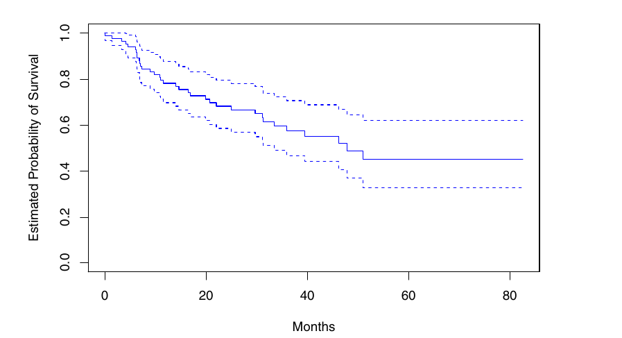

## Intro

- In survival analysis, we study the data where the outcome variable is the time until an event occurs.

- Eg: death of a cancer patient, re-employment of an unemployed worker, machine becoming unserviceable, etc.

- The time taken for for the event to occur (from beginning of/entry into the study) is called the *survival time*. The event occurring is referred to as *failure*.

- Hereafter, we will assume that failure can only occur once.

- Survival time by the random variable $T \geq 0$.

## Censoring

- Censoring occurs when at some point of time, we lack information about the subject and hence cannot determine the survival time exactly.

- Happens due to i) attrition or ii) the study ending.

- Data can be i) *right-censored* ii) *left censored* or iii) *mid (interval) censored*

- Hereafter, we will assume data to be right censored.

## Censoring (Contd.)

- Censoring is denoted by the random variable $\delta$.

. . .

$$
\delta = \begin{cases} 
    1 & \text{if failure} \\
    0 & \text{if censored} \\
\end{cases}
$$

## Survivor Function

- Denoted by $S(t)$.

. . .

$$S(t) = \mathbb{P}(T > t)$$

- Gives the probability that a person survives longer than some specified time $t$.

- $S(0) = 1$ and $S(\infty) = 0$.

## Hazard Function

- Denoted by $h(t)$

. . .

$$h(t) = \lim_{\Delta t \to 0 } \frac{\mathbb{P}(t < T \leq t + \Delta T | T \geq t)}{\Delta t}$$

- Gives the instantaneous potential per unit time for the event to occur, given that the individual has survived up to time t.

- Also known as the *conditional failure rate*

- $h(t) \geq 0$. Has no upper bound.

## Relationship between Survivor & Hazard Functions

- $S(t) = \exp{\left[- \int_{0}^{t} h(u) du\right]}$

- $h(t) = - \left[\frac{\frac{d S(t)}{dt}}{S(t)} \right]$

## Hazard Function from Survivor Function (Derivation) {.scrollable .smaller}

. . .

$$
\begin{aligned}
&& S(t) &= \mathbb{P}(T > t)\\
& \Rightarrow 
& \frac{dS(t)}{dt} 
&= \lim_{\Delta t \to 0 } \frac{\mathbb{P}(T > t + \Delta t) - \mathbb{P}(T > t)}{\Delta t}\\
& \Rightarrow
& -\frac{dS(t)}{dt} 
&= \lim_{\Delta t \to 0 } \frac{\mathbb{P}(T > t) - \mathbb{P}(T > t + \Delta t)}{\Delta t}\\
&&& = \lim_{\Delta t \to 0 } \frac{\mathbb{P}(t < T \leq t + \Delta t)}{\Delta t}\\
&&& = \lim_{\Delta t \to 0 } \frac{\mathbb{P}(t < T \leq t + \Delta t) \cap \mathbb{P}(T > t)}{\Delta t}\\
& \Rightarrow
& - \left[\frac{\frac{d S(t)}{dt}}{S(t)} \right] 
&= \lim_{\Delta t \to 0 } \frac{1}{\Delta t} \frac{\mathbb{P}(t < T \leq t + \Delta t) \cap \mathbb{P}(T > t)}{\mathbb{P}(T > t)}\\
&&& = \lim_{\Delta t \to 0 } \frac{\mathbb{P}(t < T \leq t + \Delta t | T > t)}{\Delta t} \\
& \Rightarrow
& - \left[\frac{\frac{d S(t)}{dt}}{S(t)} \right]
&= h(t)
\end{aligned}
$$

## Kaplan Meier Estimator

- Descriptive statistics about about survival time such as average survival time are not very helpful as they do not account for censoring.

- The *Kaplan Meier Estimator* is a non-parametric model used to estimate survival time.

- It is denoted by $\widehat{S}(t)$

- It deals the problem of censoring by using a recursive formula to account for it.

## Kaplan Meier Estimator (Contd.) {.scrollable}

$$
\begin{aligned}
\widehat{S}(t_j)
&= \prod_{i = 1}^{j} \widehat{\mathbb{P}}(T > t_j | T > t_{j-1})\\
&= \prod_{i = 1}^{j} \left(\frac{r_j - q_j}{r_j}\right)
\end{aligned}
$$

. . .

where $r_j$ is the number of individuals alive just before $t_j$, and $q_j$ is the number of individuals who fail at $t_j$.

- $r_j$ is also called the cardinality of the *risk set*. it is essentially the difference of the number of individuals failing or getting censored at $t_{j-1}$ from the number of individuals surviving in $t_{j-1}$.

- The above formula is also known as the *product limit formula*.

## Kaplan Meier Estimator (Derivation) {.scrollable .smaller}

. . .

$$
\begin{aligned}
\widehat{S}(t_j)
&= \widehat{\mathbb{P}}(T > t_j)\\
&= \widehat{\mathbb{P}}(T > t_j | T > t_{j-1})\widehat{\mathbb{P}}(T > t_{j-1}) \\
& \quad + \widehat{\mathbb{P}}(T > t_j | T \leq t_{j-1})\widehat{\mathbb{P}}(T \leq t_{j-1}) 
& \{\text{Law of Total Probability}\}\\
&= \widehat{\mathbb{P}}(T > t_j | T > t_{j-1})\widehat{\mathbb{P}}(T > t_{j-1}) + 0\\
&= \prod_{i = 1}^{j} \widehat{\mathbb{P}}(T > t_i | T > t_{i-1})\\
&= \prod_{i = 1}^{j} \frac{\widehat{\mathbb{P}}(T > t_i) \cap \widehat{\mathbb{P}}(T > t_{i-1})}{\widehat{\mathbb{P}}(T > t_{i-1})}\\
&= \prod_{i = 1}^{j} \frac{\widehat{\mathbb{P}}(T > t_i)}{\widehat{\mathbb{P}}(T > t_{i-1})}\\
&= \prod_{i = 1}^{j} \left(\frac{r_i - q_i}{r_i}\right)
\end{aligned}
$$

## Kaplan Meier Curve

{fig-align="center"}

## The Cox Proportional Hazard (PH) Model

- If we intend to obtain the survivor or hazard function while controlling for a set of covariates, we use the Cox PH Model,

- It is a semi-parametric model, which assumes the hazard function to take a following form:
$$
h(t|\mathbf{X_i}) = h_0(t) \exp (\boldsymbol{\beta}^T \mathbf{X_i})
$$
where $h_0 \geq 0$ is an unspecified baseling hazard function, and $\mathbf{X_i}$ is vector of covariates for observation $i$.

## Why is Cox PH Semi-Parametric?

- **The PH Assumption:** The model makes some assumptions about the functional form for the hazard function.

- **Unspecified Baseline:** However, the baseline function ($h_0$) is unspecified.

- These makes the model flexible. If the data does have an underlying parametric distribution, the Cox PH model will approximate it.

- However, these also affect when we can apply the model, and how we interpret it.

## Hazard Ratio

- Take two vectors $\mathbf{X_i}$ and $\mathbf{X_j}$ of same dimension.

- The Hazard Ratio is given by:
  $$
  \begin{align}
  \widehat{HR} &= \frac{\widehat{h}(t, \mathbf{X_i})}{\widehat{h}(t, \mathbf{X_j})}\\
  &= \frac{h_0(t) \exp (\boldsymbol{\beta}^T \mathbf{X_i})}{h_0(t) \exp (\boldsymbol{\beta}^T \mathbf{X_j})} \\
  &= \exp (\boldsymbol{\beta}^T(\mathbf{X_i} - \mathbf{X_j}))
  \end{align}
  $$

- A result of the PH assumption is that the HR stays constant over time.

## Cox Likelihood

- Given we are leaving $h_0$ unspecified, we maximize only the partial likelihood of Cox PH.

- Assume there are no ties in in time of failure.

- The partial likelihood is given by:
  $$
  PL(\boldsymbol{\beta}) = \prod_{i:\delta_i = 1} \frac{\exp(\boldsymbol{\beta}^T \mathbf{X}_i)}{\sum_{i^\prime: T_{i^\prime} \geq T_i} \exp(\boldsymbol{\beta}^T \mathbf{X}_{i^\prime})}
  $$

## Cox Likelihood(contd.) {.smaller}

- If we relax the "no ties" assumption there are two estimators we can use.

- **Breslow Estimator:**
  $$
  \begin{align}
  PL(\boldsymbol{\beta}) 
  &= 
  \prod_{l=1}^r \frac{\exp(\boldsymbol{\beta}^T \mathbf{X}^*_l)}{ \left[ \sum_{l^\prime: T_{l^\prime j} \geq T_{lj}} \exp(\boldsymbol{\beta}^T \mathbf{X}^*_{l^\prime j}) \right] ^{d_l}}
  \end{align}
  $$

- **Efron Correction:**
  $$
  \begin{align}
  PL(\boldsymbol{\beta})
  &=
  \prod_{l=1}^r{\frac{\exp(\boldsymbol{\beta}^T \mathbf{X}^*_l)}{\prod_{j=1}^{d_l} \left[ \sum_{l^\prime: T_{l^\prime j} \geq T_{lj}} \exp(\boldsymbol{\beta}^T \mathbf{X}^*_{l^\prime j}) - (j -1) \frac{1}{d_l} \sum_{k=1}^{d_l}  \exp(\boldsymbol{\beta}^T \mathbf{X}_{lk}) \right]} }
  \end{align}
  $$

- The *Berslow Estimator* is computationally simpler but more biased to underestimation compared to the *Effron Correction*.

## Cox Likelihood without Ties (Derivation) {.scrollable}

- Take an uncensored observation $i$ with failure time $T_i$.

- The hazard function for the $i^\text{th}$ observation at time $T_i$ is $h(T_i|\mathbf{X}_i) =  h_0(T_i) \exp (\boldsymbol{\beta}^T \mathbf{X}_i)$.

- The total hazard for at time $T_i$ for the at risk population is $\sum_{i^\prime: T_{i^\prime} \geq T_i} h_0(T_i) \exp(\boldsymbol{\beta}^T \mathbf{X}_{i^\prime})$

- Thus, the probability that observation $i$ is the one to fail at observation $T_i$ is $\frac{h_0(T_i) \exp(\boldsymbol{\beta}^T \mathbf{X}_i)}{h_0(T_i) \sum_{i^\prime: T_{i^\prime} \geq T_i} \exp(\boldsymbol{\beta}^T \mathbf{X}_{i^\prime})} = \frac{\exp(\boldsymbol{\beta}^T \mathbf{X}_i)}{\sum_{i^\prime: T_{i^\prime} \geq T_i} \exp(\boldsymbol{\beta}^T \mathbf{X}_{i^\prime})}$

- We get the partial likelihood by taking a product of these probabilities over all uncensored observations.
  $$
  PL(\boldsymbol{\beta}) = \prod_{i:\delta_i = 1} \frac{\exp(\boldsymbol{\beta}^T \mathbf{X}_i)}{\sum_{i^\prime: T_{i^\prime} \geq T_i} \exp(\boldsymbol{\beta}^T \mathbf{X}_{i^\prime})}
  $$

## Cox Likelihood with Ties (Derivation) {.smaller .scrollable}

- Assume we have $r$ distinct failure times with $d_l$ deaths at the $l^\text{th}$ distinct time. $T^*_{11} = T^*_{12} = \cdots = T^*_{1d_1} < T^*_{21} = T^*_{22} = \cdots = T^*_{2d_2} < \cdots \\ \hspace{18em} < T^*_{r1} = T^*_{r2} = \cdots = T^*_{rd_r}$

- Let $\mathbf{X}^*_{lj}$ be the vector of covariates for the observation that fails at time $T^*_{lj}$. Let $\mathbf{X}^*_{l} = \sum_{j=1}^{d_l}{\mathbf{X}^*_{lj}}$.

- Suppose we knew $T^*_{l1} < T^*_{l2} < \cdots < T^*_{ld_l}$.

- In this case the Cox Likelihood would be:
  $$
  \begin{align}
  PL(\boldsymbol{\beta}) 
  &=
  \prod_{l=1}^r\prod_{j=1}^{d_l}\frac{\exp(\boldsymbol{\beta}^T \mathbf{X}^*_{lj})}{\sum_{l^\prime, j^\prime: T_{l^\prime j^\prime} \geq T_{lj}} \exp(\boldsymbol{\beta}^T \mathbf{X}^*_{l^\prime j^\prime})} 
  \\&= 
  \prod_{l=1}^r\frac{\prod_{j=1}^{d_l}{\exp(\boldsymbol{\beta}^T \mathbf{X}^*_{lj})}}{\prod_{j=1}^{d_l} \left[ \sum_{l^\prime, j^\prime: T_{l^\prime j^\prime} \geq T_{lj}} \exp(\boldsymbol{\beta}^T \mathbf{X}^*_{l^\prime j^\prime})\right] } 
  \\&= 
  \prod_{l=1}^r{\frac{\exp(\boldsymbol{\beta}^T \mathbf{X}^*_l)}{\prod_{j=1}^{d_l} \left[ \sum_{l^\prime: T_{l^\prime j} \geq T_{lj}} \exp(\boldsymbol{\beta}^T \mathbf{X}^*_{l^\prime j}) - \sum_{j^{\prime\prime}: T_{lj^{\prime\prime}} < T_{lj}} \exp(\boldsymbol{\beta}^T \mathbf{X}^*_{lj^{\prime\prime}}) \right]} }
  \end{align}
  $$

- However, we don't know $T^*_{l1} < T^*_{l2} < \cdots < T^*_{ld_l}$ due to ties. Hence, we cannot estimate $\sum_{j^{\prime\prime}: T_{lj^{\prime\prime}} < T_{lj}} \exp(\boldsymbol{\beta}^T \mathbf{X}^*_{lj^{\prime\prime}})$.

- We shall consider two ways of approximating the likelihood.

- **Breslow Estimator:** Ignore the sum. Hence, the Cox likelihood becomes:
  $$
  \begin{align}
  PL(\boldsymbol{\beta})
  &= 
  \prod_{l=1}^r \frac{\exp(\boldsymbol{\beta}^T \mathbf{X}^*_l)}{ \left[ \sum_{l^\prime: T_{l^\prime j} \geq T_{lj}} \exp(\boldsymbol{\beta}^T \mathbf{X}^*_{l^\prime j}) \right]^{d_l}}
  \end{align}
  $$

- **Efron Correction:** Replace the sum by $j-1$ times the average.
  $$
  \sum_{j^{\prime\prime}: T_{lj^{\prime\prime}} < T_{lj}} \exp(\boldsymbol{\beta}^T \mathbf{X}_{lj^{\prime\prime}}) \approx (j -1) \frac{1}{d_l} \sum_{k=1}^{d_l}  \exp(\boldsymbol{\beta}^T \mathbf{X}_{lk})
  $$
  Hence, the Cox likelihood becomes:
  $$
  \begin{align}
  PL(\boldsymbol{\beta})
  =
  \prod_{l=1}^r{\frac{\exp(\boldsymbol{\beta}^T \mathbf{X}^*_l)}{\prod_{j=1}^{d_l} \left[ \sum_{l^\prime: T_{l^\prime j} \geq T_{lj}} \exp(\boldsymbol{\beta}^T \mathbf{X}^*_{l^\prime j}) - (j -1) \frac{1}{d_l} \sum_{k=1}^{d_l}  \exp(\boldsymbol{\beta}^T \mathbf{X}_{lk}) \right]} }
  \end{align}
  $$

## Weibull Model

- This a parametric distribution

- The hazard function takes the following form: $h(t, \mathbf{X}) = \lambda(t, \mathbf{X}) p t^{p-1}$  
where $\lambda(t, \mathbf{X}) = \exp(\beta_0 + \boldsymbol{\beta}^T\mathbf{X}) > 0$ and $p>0$

- Here, $\lambda$ is called the *scale parameter* and $p$ is called the shape parameter.

- [Simulation of Weibull Distribution](https://sesen.ai/distribution-explorer/weibull)

## Shape & Hazard in Weibull Model

- $p>1 \implies$ hazard increases over time.

- $p=1 \implies$ constant hazard (equivalent to an exponential model where $h(t) = \lambda(t)$).

- $p<1 \implies$ hazard decreases over time.

## Hazard Ratio in a Weibull Model

- Take two different observation $i$ and $j$ with covariates $\mathbf{X}_i$ and $\mathbf{X}_j$ respectively.

- The *hazard ratio* is given by:
  $$\begin{align}
  \widehat{HR} &= \frac{\widehat{h}(t, \mathbf{X_i})}{\widehat{h}(t, \mathbf{X_j})}\\
  &= \frac{\exp (\beta_0 + \boldsymbol{\beta}^T \mathbf{X_i}) p t^{p-1}} {\exp (\beta_0 + \boldsymbol{\beta}^T \mathbf{X_j}) p t^{p-1}} \\
  &= \exp (\boldsymbol{\beta}^T(\mathbf{X_i} - \mathbf{X_j}))
  \end{align}$$

## The Accelerated Failure Time (AFT) Assumption

- Take $T_1$ and $T_2$ to be the survival times associated with two groups, the AFT assumption says that $T_1 = \gamma T_2$ and $S(t_1) = S(\gamma t_2), \forall t$

- Just like the underlying assumption in **PH models** is that the *effect of covariates* is *multiplicative* with respect to the ***hazard***, the underlying assumption in the **AFT Models** is that the *effect of covariates* is *multiplicative* with respect to ***survival time***.

- The $\lambda$ here is known as the **Acceleration Factor**.

## AFT in Weibull Model {.scrollable}

- We can estimate the Weibull survivor function from the hazard function:
  $$\begin{align}
  &&
  h(t, \mathbf{X}) &= \lambda(t, \mathbf{X}) p t^{p-1}\\
  &
  \Rightarrow & S(t, \mathbf{X}) &= \exp(-\lambda(t, \mathbf{X}) t^p)
  \end{align}$$

- Take $t$ to the LHS:
  $$\begin{align}
  t &= [- \ln S(t, \mathbf{X})]^{\frac{1}{p}} \times \frac{1}{\lambda(t, \mathbf{X}) ^ {\frac{1}{p}}}
  \end{align}$$

- Reparametrize $\frac{1}{\lambda(t, \mathbf{X}) ^ \frac{1}{p}} = \exp(\alpha_0 + \boldsymbol{\alpha}^T \mathbf{X})$

- Now, $t = [- \ln (S(t, \mathbf{X}))]^{\frac{1}{p}} \times \exp(\alpha_0 + \boldsymbol{\alpha}^T \mathbf{X})$

- Let $S(t, \mathbf{X_j}) = q$   By AFT, $S(\lambda t, \mathbf{X_i}) = q$

- Using the above definition of t,
  $$\begin{align}
  &&
  \lambda &= \frac{\lambda t}{t}\\
  &&&= 
  \frac{[- \ln (S(\lambda t, \mathbf{X_i}))]^{\frac{1}{p}} \times \exp(\alpha_0 + \boldsymbol{\alpha}^T \mathbf{X_j})} {[- \ln (S(\lambda t, \mathbf{X_j}))]^{\frac{1}{p}} \times \exp(\alpha_0 + \boldsymbol{\alpha}^T \mathbf{X_i})}\\
  &&&= 
  \frac{[- \ln (q)]^{\frac{1}{p}} \times \exp(\alpha_0 + \boldsymbol{\alpha}^T \mathbf{X_i})} {[- \ln (q)]^{\frac{1}{p}} \times \exp(\alpha_0 + \boldsymbol{\alpha}^T \mathbf{X_j})}\\
  & \Rightarrow &
  \lambda &= \exp(\boldsymbol{\alpha}^T (\mathbf{X_i} - \mathbf{X_j}))
  \end{align}$$

## AFT & PH in Weibull {.scrollable}

- In a Weibull model, if $p$ is fixed, AFT $\iff$ PH.

- We can also derive a relationship between the coefficients.

- Under AFT,
  $$\begin{align}
  && 
  \frac{1}{\lambda ^ \frac{1}{p}} &= \exp(\alpha_0 + \boldsymbol{\alpha}^T \mathbf{X}) \\
  &\Rightarrow&
  (1-p)\ln(\lambda)
  &= - (\alpha_0 + \boldsymbol{\alpha}^T \mathbf{X}) \\
  &\Rightarrow&
  \ln(\lambda) &= -p (\alpha_0 + \boldsymbol{\alpha}^T \mathbf{X})
  \end{align}$$

- Under PH
  $$\begin{align}
  &&
  \lambda &= \exp (\beta_0 + \boldsymbol{\beta}^T \mathbf{X})\\
  & \Rightarrow &
  \ln(\lambda) &= \beta_0 + \boldsymbol{\beta}^T \mathbf{X}
  \end{align}$$

- Hence, $\beta_0 = - \alpha_0$ and $\beta = - \alpha$

## References {.smaller}

::: nonincremental
- *Breslow vs Efron tie handling in Cox proportional hazards.* (2026). MetricGate. <https://metricgate.com/blogs/breslow-vs-efron-tie-handling-cox/>

- James, G., Witten, D., Hastie, T., & Tibshirani, R. (2021). *An introduction to statistical learning: With applications in R* (2nd ed). Springer. <https://www.statlearning.com/>

- Kleinbaum, D. G., & Klein, M. (2005). *Survival analysis: A self-learning text* (2nd ed). Springer.

- Waagepetersen, R. (2024, Semptember 29). *Cox’s proportional hazards model and Cox’s partial likelihood.* Aalborg University. <https://people.math.aau.dk/~rw/Undervisning/DurationAnalysis/Slides/lektion3.pdf>
:::